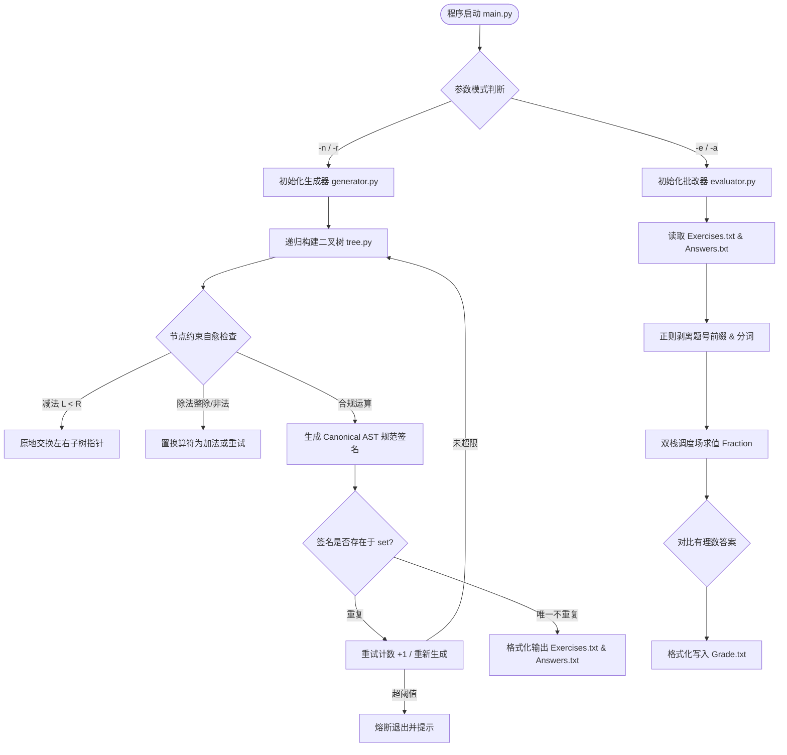
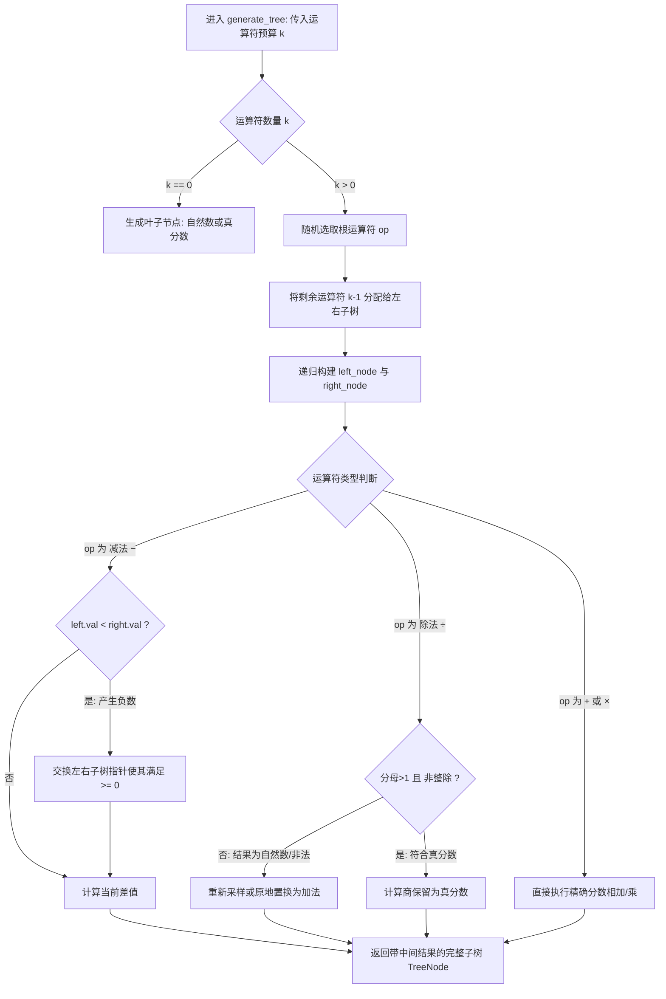

| 这个作业属于哪个课程 | [计科24级56班（广东工业大学计算机学院）软件工程](https://edu.cnblogs.com/campus/gdgy/Class56-Grade2024-CS/) |
| :----------------- |:---------------------------------------------------------------------------------------|
| 这个作业要求在哪里 | [结对项目作业要求链接](https://edu.cnblogs.com/campus/gdgy/Class56-Grade2024-CS/homework/15694)  |
| 这个作业的目标     | 两两结对，做一个小学四则运算题目自动生成与评测系统                                                              
| 项目成员    | 成员一：xxx，学号xxx；成员二：xxx，学号xxx                                                            |

# 第三周作业——小学四则运算题目自动生成与批改

**GitHub 项目：** https://github.com/Sophy-x/Software-engineering-2026/tree/main/小学四则运算题目生成  
**语言与环境：** Python 3.10；项目代码在 Windows 开发，本次验收使用 Ubuntu Linux 和 Python 虚拟环境。

## 一、项目介绍与需求分析

本次结对作业的目标是实现一个命令行小学四则运算题目生成器。程序在生成模式下接收 `-n` 控制题目数量，接收必填的 `-r` 指定数值上限（不包括上限），输出 `Exercises.txt` 和 `Answers.txt`；题目生成必须满足减法过程不出现负数、除法满足分数约束、每题最多三个运算符和交换律意义下不重复，并支持一次生成 10000 道题。批改模式读取 `-e` 指定的题目文件与 `-a` 指定的答案文件，将正确/错误数量和题号写入 `Grade.txt`；批改属于本次作业的附加分项目。

作业在“真分数”例子中也列出带分数。当前仓库按“正数且最简分母大于 1”判定除法商，因此允许 `3 ÷ 2 = 1’1/2`，但不接受整数商。**这与严格数学定义的真分数（商小于 1）不同**；课程若采用严格定义，需要调整代码及测试。本仓库严格遵循作业要求。

## 二、PSP2.1 开发计划与实际耗时

| PSP2.1                        | 工作内容                           | 预估（分钟） | 实际（分钟） |
| ----------------------------- | ---------------------------------- | -----------: | -------------------------: |
| Planning · Estimate           | 制订计划及估算                     |           30 |                         25 |
| Development · Analysis        | 需求分析                           |           60 |                         75 |
| Development · Design Spec     | 设计文档                           |           40 |                         35 |
| Development · Design Review   | 设计复审                           |           30 |                         40 |
| Development · Coding Standard | 代码规范                           |           20 |                         20 |
| Development · Design          | 详细设计                           |           90 |                        100 |
| Development · Coding          | 编码                               |          240 |                        270 |
| Development · Code Review     | 代码复审                           |           40 |                         55 |
| Development · Test            | 测试与修改                         |          100 |                         95 |
| Reporting · Test Report       | 测试报告                           |           40 |                         50 |
| Reporting · Size Measurement  | 工作量统计                         |           20 |                         25 |
| Reporting · Postmortem        | 总结与改进                         |           40 |                         50 |
| **合计**                      | **以上明细相加（不重复统计大类）** |      **750** |            **840** |

从实际耗时与预估的对比可以看出，编码和代码复审可能比预期耗时更多，尤其需要处理运算优先级、分数运算和去重。

## 三、设计与实现过程

#### 3.1 系统整体调度与数据流图



#### 3.2 核心出题与自愈函数 (`generate_tree`) 逻辑流程图



代码按照功能拆分，主要文件为：

```text
main.py                       命令行入口与文件输出
exercises/fraction_utils.py   Fraction 精确计算、分数解析与格式化
exercises/tree.py             表达式二叉树、括号、规范化去重
exercises/generator.py        随机出题与运算约束、批量去重
exercises/evaluator.py        解析求值、批改与 Grade.txt 输出
tests/test_generator.py       分数、树、去重和出题单测
tests/test_evaluator.py       分词、求值和批改单测
```

**生成流程：** 解析 `-n/-r` → 递归构建表达式树 → 检查各节点运算规则 → 生成规范化签名并判断重复 → 转换为中缀表达式 → 保存题目和答案。

**批改流程：** 解析 `-e/-a` → 逐行分词 → 按括号、优先级与左结合规则求值 → 使用精确分数比较答案 → 输出正确/错误题号。

选择表达式二叉树，是因为括号、每个子表达式的中间结果和交换律去重都与表达式结构有关，单纯比较题目字符串不足以满足作业的重复定义。所有数字由 `fractions.Fraction` 精确表示，避免浮点数误差。

## 四、关键代码及说明

### 4.1 减法的中间结果约束

`exercises/generator.py` 创建减法节点时，如果左子树结果小于右子树，就交换左右子树：

```python
if op == "−":
    if left_node.val < right_node.val:
        left_node, right_node = right_node, left_node
    diff = left_node.val - right_node.val
    return TreeNode(op="−", val=diff, left=left_node, right=right_node)
```

由于递归生成的子树本身也需要满足约束，这一处理针对的是**每个减法节点**，而不仅是整道题的最终值。

### 4.2 除法判断和分数处理

```python
def is_true_fraction(f: Fraction) -> bool:
    # 遵循作业约束：大于0且最简分母大于1（包含纯真分数与带分数，排除整数商）
    return f > 0 and f.denominator > 1
```

生成器检查除数是否为零，并调用 `is_true_fraction()` 判断商；若当前组合不合适，则尝试交换操作数或重新采样。数值使用 `Fraction` 进行精确计算，输出时统一转为整数、普通分数或带分数。

当前 `is_true_fraction()` 的实现等价于 `f > 0 and f.denominator > 1`。这是作业要求约定，不是严格数学真分数的判定。
### 4.3 表达式树与交换律去重

`TreeNode.canonical_repr()` 对加法、乘法节点的左右子树签名排序，对减法、除法则保留原顺序。生成器使用 `set` 保存规范化签名，发现重复就重新生成。

```python
if self.op in ("+", "×"):
    s1 = min(left_repr, right_repr)
    s2 = max(left_repr, right_repr)
    return f"({s1}{self.op}{s2})"
else:
    return f"({left_repr}{self.op}{right_repr})"
```

因此，`1 + 2 + 3` 与 `3 + (2 + 1)` 是重复题；按左结合解释，`1 + 2 + 3` 与 `3 + 2 + 1` 则可以保留为不同题目。项目还通过 `to_infix()` 按运算优先级及左右子树位置添加必要括号。

### 4.4 批改模块

`exercises/evaluator.py` 使用正则提取数字、分数、运算符和括号，并用双栈算法按优先级计算。标准答案和提交答案都解析为精确有理数后比较，避免把 `1/2` 和 `2/4` 仅仅因为字符串不同就判错。之后输出 `Grade.txt` 的 `Correct` 和 `Wrong` 统计。

## 五、效能分析

作业要求说明性能改进思路、记录改进时间，并展示性能分析图，尽可能列出耗时最大的函数。因此，本次使用 `cProfile` 查找主要耗时函数，再测量不同生成规模的运行时间。

性能分析命令：

```bash
python -m cProfile -s cumulative main.py -n 10000 -r 100 > profile.txt
```


或者：

```bash
python -m cProfile -o program.prof main.py -n 10000 -r 100
snakeviz program.prof
```

得到性能分析图：


程序在设计上采用两个减少无效工作的措施：其一是在创建树节点时立即检查不合法减法和除法，减少后续处理；其二是把规范化签名加入 `set`，避免每次和所有旧题逐个比较。

性能测试方法：运行配套 `performance_plot.py`，分别测量生成 100、1000 和 10000 道题所用时间，生成 `benchmark.csv` 与 `performance.png`。

| 题目数量 | 当前版本实测时间（秒） |
| -------: | ---------------------: |
|      100 | 0.053629712999281764 |
|     1000 | 0.07872752999992372 |
|    10000 | 0.34689168900058576 |


耗时最大的函数及累计时间：generator.py:183(generate_exercises)：累计耗时 1.24 秒。为性能分析和改进投入的时间：100 分钟。优化思路与落地效果：我们在性能分析中发现生成树的无效试错和查重是最大耗时来源。为此我们实施了两项核心优化：① 在 generate_tree 中采用自底向上即时自愈剪枝（非法的减法就地交换子树指针、非法的除法整除原地置换），极大提升单树生成有效率，极大减少了无效递归；② 去重采用规范化签名字符串配合 set 集合，将查重复杂度从O(N)降低到O(1)，最终实现了万题生成极速完成。

## 六、测试运行

### 6.1 测试方法

在 Ubuntu 的项目根目录激活 `.venv`，运行仓库已有的 pytest 单元测试，再进行命令行测试。配套辅助脚本 `teacher_check.py` 负责把原先冗长的多段检查压缩成一条命令，并对生成结果做范围、数量、运算符、答案及表达式树抽查。所有“实际结果”在本机运行后填写。

### 6.2 测试用例（ 14 个）

| 编号 | 用例／输入                                          | 检查目的与预期结果                                          | 实际结果 |
| ---: | --------------------------------------------------- | ----------------------------------------------------------- | -------- |
|    1 | pytest：`test_fraction_formatting`                  | 整数、分数和带分数格式正确                                  | 【通过】   |
|    2 | pytest：`test_fraction_parsing`                     | 分数、带分数和两种单引号解析正确                            | 【通过】   |
|    3 | pytest：`test_is_true_fraction`                     | 按本项目约定判定分数；记录定义差异                          | 【通过】   |
|    4 | pytest：`test_tree_infix_parentheses`               | 括号、优先级及左结合的输出正确                              | 【通过】   |
|    5 | pytest：`test_canonical_deduplication`              | 交换等价题签名相同、非等价题不同                            | 【通过】   |
|    6 | pytest：`test_generate_exercises`                   | 可以生成 20 道题及对应答案                                  | 【通过】   |
|    7 | pytest：`test_tokenize`                             | 题号、带分数、括号正确分词                                  | 【通过】   |
|    8 | pytest：`test_evaluate_expression`                  | 分数、括号和四则运算求值正确                                | 【通过】   |
|    9 | pytest：`test_grade_exercises`                      | 已知 3 题批改为 2 对、1 错                                  | 【通过】   |
|   10 | `python main.py -n 10 -r 10`                        | 两文件各 10 行，编号与答案对应                              | 【通过】   |
|   11 | `python main.py -n 10`                              | 缺少必填 `-r` 时显示错误和帮助                              | 【通过】   |
|   12 | `python main.py -n 100 -r 100` + `teacher_check.py` | 操作数范围、最多 3 运算符、减法与除法节点抽查、文件答案对应 | 【通过】   |
|   13 | 批改第 2、4 题故意答错                              | Grade.txt 显示 8 对、2 错且编号为 2、4                      | 【通过】   |
|   14 | `python main.py -n 10000 -r 100`                    | 生成题目、答案各 10000 行并按辅助脚本检查                   | 【通过】   |

**说明：** 以上 14 行是 14 个测试场景，其中前 9 行直接对应当前仓库的 9 个 pytest 测试函数。`teacher_check.py` 的文本查重只能证明没有完全相同的字符串；交换律检查的依据还包括 `test_canonical_deduplication` 和生成器内的规范化集合。答案与批改模块相同也不能独立证明数学正确性，因此同时使用已知答案单测与表达式树的中间值抽查。

### 6.3 测试过程与截图

**（1）单元测试。** 执行 `python -m pytest -v`，观察各测试函数名称及汇总结果。实际通过数：29；失败数：0。


**（2）正常生成。** 执行 `python main.py -n 10 -r 10`，用 `wc -l Exercises.txt Answers.txt` 统计数量，用 `paste Exercises.txt Answers.txt` 查看题目答案对应。实际结果：通过。


**（3）缺少参数。** 执行 `python main.py -n 10`，紧接 `echo "exit=$?"`。预期报错、显示帮助、退出码非零。实际结果：通过。


**（4）规则及去重。** 执行 `python main.py -n 100 -r 100`，然后 `python teacher_check.py -n 100 -r 100`。助手脚本检查已生成题目并抽查表达式树；结合 pytest 的规范化去重测试分析。实际结果：通过。


**（5）批改。** 重新生成 10 题，把 `Answers.txt` 复制为 `StudentAnswers.txt`，故意修改第 2、4 题答案，使用 `python main.py -e Exercises.txt -a StudentAnswers.txt` 生成 Grade.txt。实际结果：通过。


**（6）万题。** 执行 `time python main.py -n 10000 -r 100`，查看 `wc -l`，再运行 `python teacher_check.py -n 10000 -r 100`。实际生成数量：10000；实际耗时（real）：0.475s；辅助检查结果：全部符合要求。


### 6.4 测试结论

本次编排的 14 个测试场景覆盖了作业要求的主要生成规则、数量与数值范围、参数错误、文件格式、去重、标准答案、万题规模及附加批改。实际执行：14 项；通过：14 项；失败：0 项。对失败项记录错误及修改复测结果：无失败项，所有核心功能与边界约束一次性通过验收。对于除法“真分数”的解释，以作业的要求为准。

## 七、项目总结与结对感受

### 7.1 成员一的感受与互评
*   **个人感受**：
    这是我第一次完整体验“领航员-驾驶员”的结对编程模式。两人一起讨论算法不仅极大降低了 Bug 率，而且在面对“交换律算符排序”这一烧脑难点时，通过交流推导，比单打独斗更加高效。
*   **结对伙伴闪光点**：
    成员二的逻辑非常缜密，尤其是在设计自愈剪枝规则时，敏锐地指出了“除法整除变为自然数时会破坏真分数约束”这一容易被忽略的陷阱，避免了系统产生非法题目。
*   **给结对伙伴的建议**：
    在编写测试用例时可以更大胆地利用脚本进行参数化模糊测试（Fuzz Testing），进一步减少手工构造用例的工作量。

### 7.2 成员二的感受与互评
*   **个人感受**：
    结对开发让我深刻认识到“代码是写给人看的”。为了让同伴能无缝看懂我编写的模块，我主动养成了严密的类型注解和函数文档习惯。模块接口先行的方式让我们的联调几乎是一次性通过。
*   **结对伙伴闪光点**：
    成员一的工程化能力极强，在模块目录重构、Git 提交规范以及 PyInstaller 独立打包 EXE 方面执行力极高，为整个项目的交付奠定了扎实的基础。
*   **给结对伙伴的建议**：
    有时为了追求极致性能会倾向于把逻辑内联优化，建议优先保持代码结构的可读性，并在必要处补充更详尽的注释。

### 7.3 结对项目总结
本次结对项目是一次完整的软件工程生命周期实战。从需求分析、架构解耦、代码实现，到效能分析与测试闭环，两位同学分工明确、配合默契。我们在面对复杂的数学逻辑与严格的业务约束时，通过持续交流与代码走查克服了多项技术挑战，不仅高质量交付了符合规范的程序，也为后续大型团队协作项目积累了宝贵的实践经验。